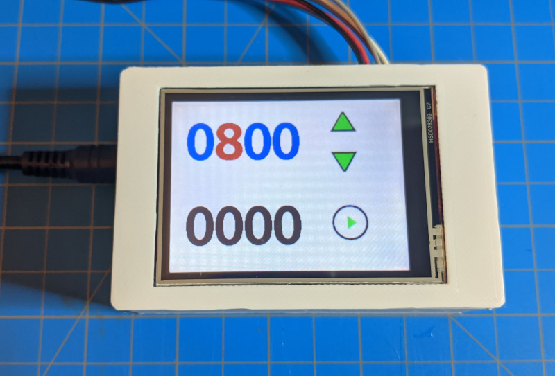
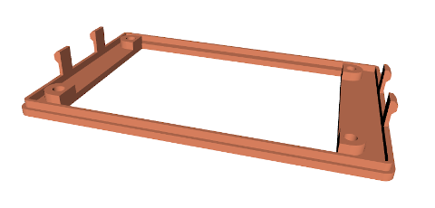
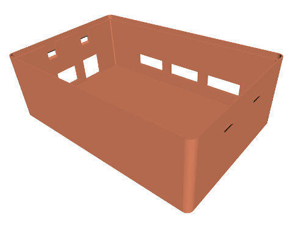
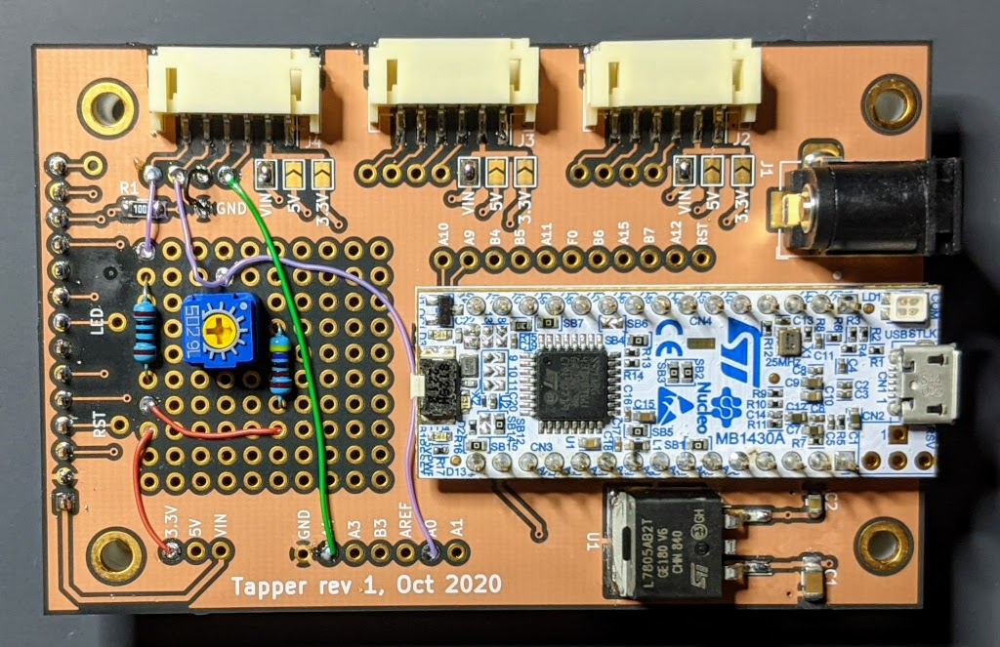
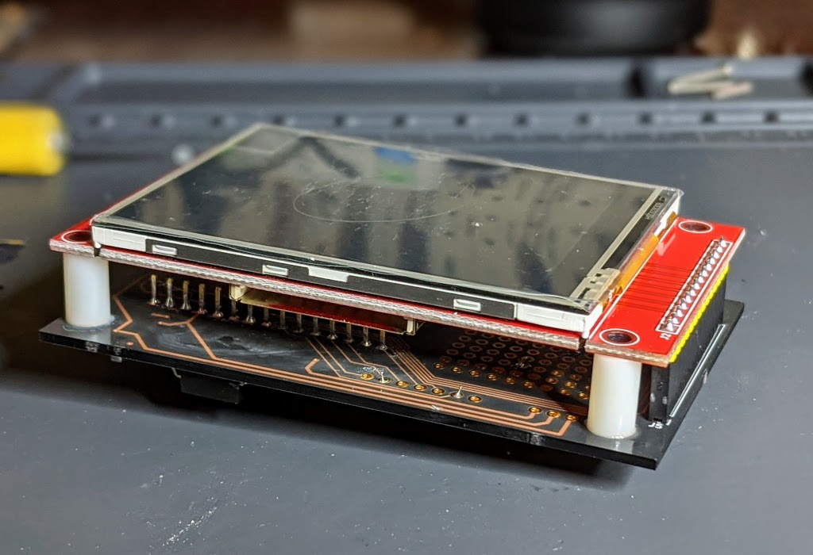
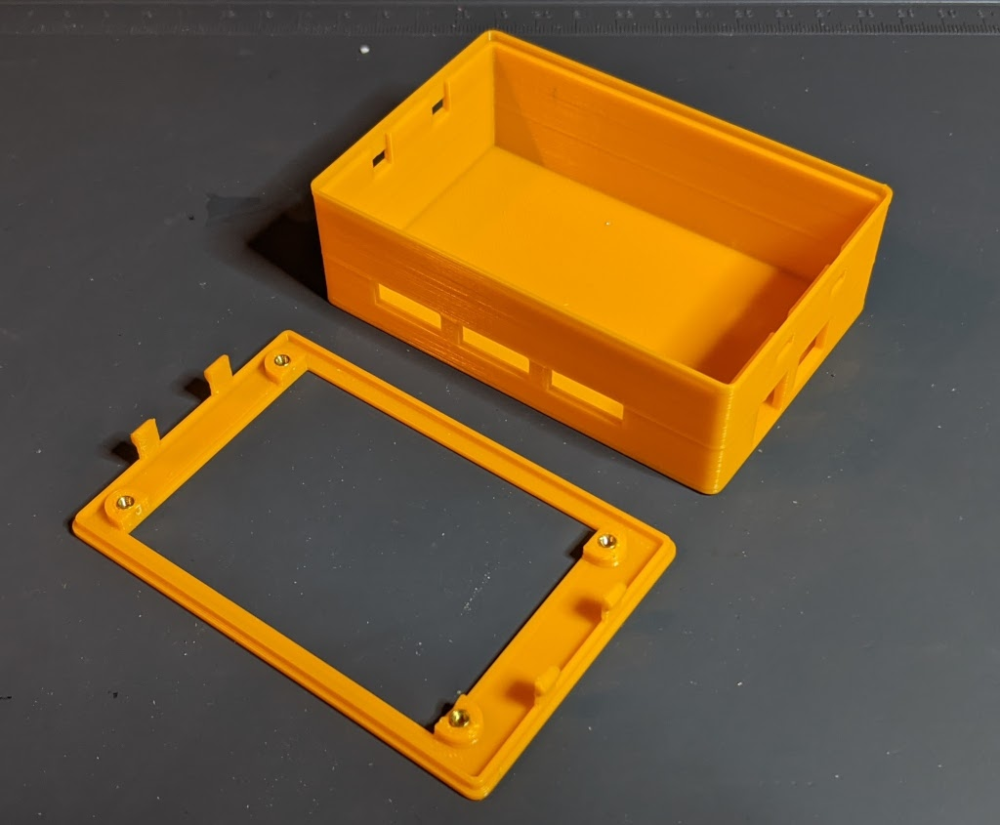
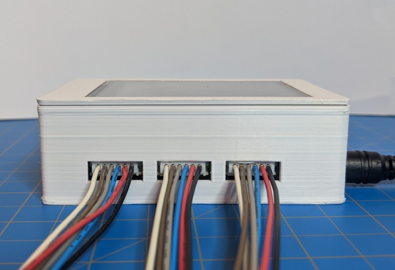
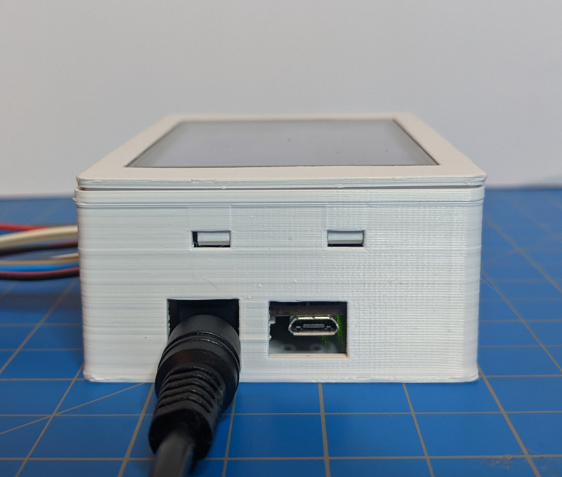

# Tapper

A flexible way to build well-packaged touch-screen based devices with 
STM32 nucleo-32 boards. 

## Introduction

I wanted a quick and easy way to bring up any kind of touch screen based 
device that wasn't a one-off jumble of wires and/or breadboards.
My main requirements are that it needs a case, and it needs to be connecterized. 
I wanted to keep some flexibility though, because you can't quite predict which 
pins you need to wire out to which connectors next time, and you might need a 
bit of extra circuitry. 

On tapper, the connector IOs are connected only to test points. 
The MCU pins are also wired out to test points. To customize for a particular 
application, just solder jumper wires to connect as neded. 
There's also a small amount of 0.1" pitch hole array for prototyping; enough 
to fit a couple chips and discretes, e.g. using SMT to DIP adapters.

PDF schematic can be found [here](pcb/Tapper_rev2_schematic.pdf).

Bill of materials can be found [here](pcb/BOM.xlsx).

Gerbers can be found under github releases, if you want to build one!

## Powering 

The Tapper has a 5.5x2.1mm barrel connector for power input (7V min, up to about 
12-ish V[1](#maxvolts)), or, optionally it can be powered via the USB connector if you
don't need any voltage higher than 5V. 
For my initial application I needed a higher voltage for motor control, so
the tapper includes a linear regulator to generare the 5V input for the nucleo.
Thanks to the diode-or on the nucleo-32 board, it is safe to provide both USB 
power and an extra VIN. 

## Connectors

There are three 6-pin JST SH connectors. [Pre-made pigtails](https://www.digikey.com/en/products/detail/trinamic-motion-control-gmbh/CABLE-PH06/9381902) 
can be used to connect to these. Each connector has a ground pin, a power pin 
which can be connected to 3.3V, 5V, or VIN -- selected by solder bridge -- and
four IO pins which are connected to testpoints. These can be connected by 
wires soldered to either the MCU breakout testpoints or to 
a circuit on the prototype pad array.

## STM32 Development Board

Tapper is designed for the [Nucleo-G431KB](https://www.st.com/en/evaluation-tools/nucleo-g431kb.html),
but since all of the Nucleo-32 boards have a compatible pinout -- at least 
I'm pretty sure they do, double check -- it should be easy to use a different
family of STM32 MCU. The ST Nucleo boards come with a built-in ST-LINK USB
programmer/debugger, which also provides a virtual COM port connected to the
USART on your target device.

### Nucleo board modifications

**Important: You probably need to modify your Nucleo board!**

Remove SB2 and SB3. These short PA15 to PA6 and PB7 to PA6 -- why ST thought
it was a good idea to ship development boards with jumpers shorting their 
IOs is beyond me, but removing them is the first thing I do on every nucleo 
board.

Short SB11. This connects PF1 to the IO header, and is needed to drive the 
display DC pin. Without shorting this solder bridge, the display will not
update.

## Enclosure

The enclosure can be 3D printed. Heated threaded inserts are used to provide
solid mounting points for the electronicson the top cover. See the 
[Bill of Materials](pcb/BOM.xls). It uses flexible retaining clips to hold
the two parts of the enclosure together, and this works....OK. If the print 
isn't dialed in just right, the top cover might not sit perflectly tight; 
functional but disappointing. At some point, I may redesign it to use some 
longer screws that go all the way through the enclosure. It was the first 
time I tried printing such a thing, and it was a worthwhile experiment, anyway.

### Top Model

[3D Model - STEP](enclosure/tapper_enclosure_top.step)

[3D Model - STL](enclosure/tapper_enclosure_top.stl)

### Bottom Model

[3D Model - STEP](enclosure/tapper_enclosure_bottom.step)

[3D Model - STL](enclosure/tapper_enclosure_bottom.stl)

## Example Software

This [spincoater controller](https://github.com/mcbridejc/spincoater-controller) project uses the Tapper board, and provides an
example software project using the [modm](https://modm.io) C++ peripheral library, which
I highly recommend for STM32 projects.

## Photos

## Revision History

### Revision 2 (Nov 2020)

Fix a few mistakes, including: 

- Add pull-up to display reset pin
- Power connection points labeled wrong in silkscreen (3.3V and VIN swapped, yikes)
- One mounting hole position off by 0.5mm

### Revision 1 (Oct 2020)

First prototype design. 

# Footnotes

<b id="maxvolts">1:</b>The max voltage will be limited by the thermal dissipation of the 
linear regulator, and will depend on how much power is drawn from the 5V rail. If 
it gets too hot to touch, it might be time to consider lowering your input voltage!
